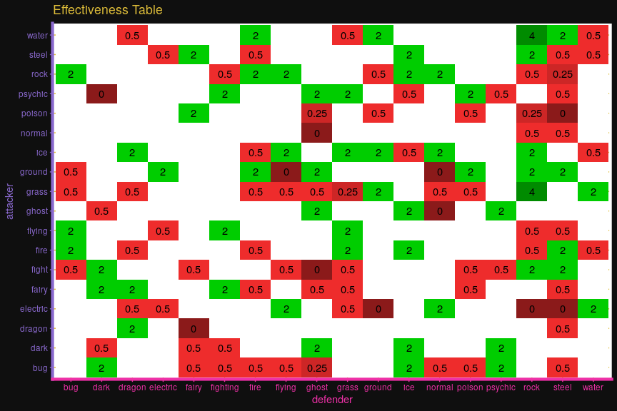

<!-- README.md is generated from README.Rmd. Please edit that file -->


Install
=======

``` r
#install.packages("devtools")
devtools::install_github("schochastics/Rokemon")
```

``` r
library(Rokemon)
library(tidyverse)
```

Themes
======

Theme Rocket

``` r
ggplot(pokemon,aes(attack,defense))+
  geom_point(col = "grey")+
  theme_rocket()+
  labs(x = "Jessy",y = "James",
       title = "Theme Rocket",
       subtitle = "blast off at the speed of light!",
       caption = "meowth that's right")
```


Gamyboy theme

``` r
ggplot(pokemon,aes(attack,defense))+
  geom_point(shape = 15,col = c("#006400"),size=2)+
  theme_gameboy()+
  labs(title = "Classic Gameboy Theme")
```


gghealth using Status theme

``` r
pokemon[1:10,] %>% 
  gghealth("name","base_total",init.size = 5)+
  labs(x="",y="Stats Total")
#>  [1] 0.2802 0.4784 0.9795 0.2597 0.4784 1.0000 0.2711 0.4784 0.9909 0.0000
#>  [1] 3 2 1 3 2 1 3 2 1 4
```


Examples
========

Using `theme_rocket()` to create an efficiency table

``` r
pokemon %>%
  distinct(type1,.keep_all=TRUE) %>%
  select(defender = type1,against_bug:against_water) %>%
  gather(attacker,effect,against_bug:against_water) %>%
  mutate(attacker = str_replace_all(attacker,"against_",""))  %>%
  ggplot(aes(y=attacker,x=defender,fill=factor(effect)))+
  geom_tile()+
  geom_text(aes(label=ifelse(effect!=1,effect,"")))+
  scale_fill_manual(values=c("#8B1A1A", "#CD2626", "#EE2C2C", "#FFFFFF", "#00CD00", "#008B00"))+
  theme_rocket(legend.position="none")+
  labs(title="Efficiency Table")
```



Annotate your plots with your favorite Pokémon Go team.

``` r

p1 <- pokemon %>%
  dplyr::filter(type1=="water") %>%
  ggplot(aes(defense,attack))+geom_point()+annotate_pogo(team = "mystic")+theme_mystic()+
  labs(title="Team Mystic",subtitle="Water Pokemon")

p2 <- pokemon %>%
  dplyr::filter(type1=="fire") %>%
  ggplot(aes(defense,attack))+geom_point()+annotate_pogo(team = "valor")+theme_valor()+
  labs(title="Team Valor",subtitle="Fire Pokemon")

p3 <- pokemon %>%
  dplyr::filter(type1=="electric") %>%
  ggplot(aes(defense,attack))+geom_point()+annotate_pogo(team = "instinct")+theme_instinct()+
  labs(title="Team Instinct",subtitle="Electric Pokemon")

gridExtra::grid.arrange(grobs=list(p1,p2,p3),ncol=3)
```


Fonts
=====

Download the Font [here](https://github.com/Superpencil/pokemon-font/releases/tag/v1.8.1)

In order to use this font in R you need the `extrafont` package.

``` r
install.packages("extrafont")
extrafont::font_import() #only run ones
extrafont::loadfonts()
```

Alternatively, you can use the function `import_pokefont()`

``` r
import_pokefont()
```

Color Palettes
==============

R package including color palettes

``` r
install.packages('palettetown')
```

Addendum
========

-   Logo generated with [fontmeme](https://fontmeme.com/pokemon-font/)
-   Pogo Logos downloaded [here](https://dribbble.com/shots/2831980-Pok-mon-GO-Team-Logos-Vector-Download)
-   Pokémon data download from [Kaggle](https://www.kaggle.com/rounakbanik/pokemon), originally scraped from [serebii.net](http://serebii.net/)
-   [Sprites](https://github.com/PokeAPI/sprites)
