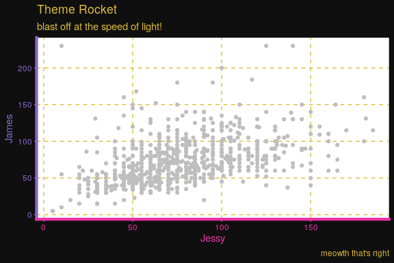
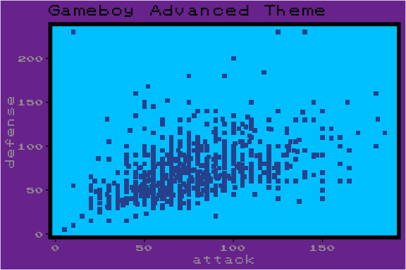
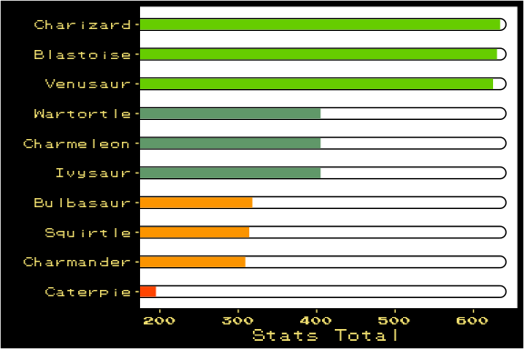
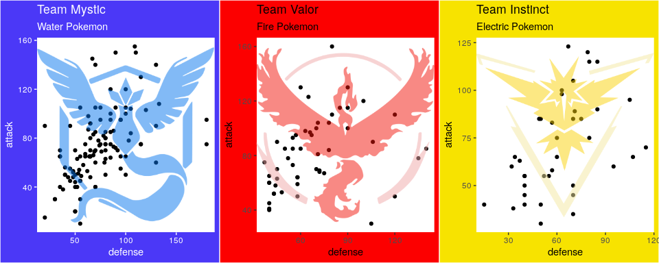

<!-- README.md is generated from README.Rmd. Please edit that file -->


An R package to create Pokemon inspired ggplots. It also comes with dataset of 801 Pokemon with 41 different features (Gotta analyze'em all!).

Install
=======

``` r
#install.packages("devtools")
devtools::install_github("schochastics/Rokemon")
```

``` r
library(Rokemon)
library(tidyverse)

data(pokemon)
```

Themes
======

The package includes several themes to style your ggplots.

Theme Rocket
------------

*(See what I did there...)*

``` r
ggplot(pokemon,aes(attack,defense))+
  geom_point(col = "grey")+
  theme_rocket()+
  labs(x = "Jessy",y = "James",
       title = "Theme Rocket",
       subtitle = "blast off at the speed of light!",
       caption = "meowth that's right")
```



Gamyboy theme
-------------

If you want to get nostalgic.

``` r
ggplot(pokemon,aes(attack,defense))+
  geom_point(shape = 15,col = "#006400",size=2)+
  theme_gameboy()+
  labs(title = "Classic Gameboy Theme")
```


``` r
ggplot(pokemon,aes(attack,defense))+
  geom_point(shape = 15,col = "#27408B",size=2)+
  theme_gba()+
  labs(title = "Gameboy Advanced Theme")
```



Status theme and HP bar chart
-----------------------------

A theme inspired by HP bar in older Pokemon games. The theme is used in `gghealth`, a function that plots bar charts in HP bar style.

``` r
pokemon[1:10,] %>% 
  gghealth("name","base_total",init.size = 5)+
  labs(x="",y="Stats Total")
```



Pokemon Go
----------

Annotate your plots with the logo of your favorite Pokémon Go team.

``` r

p1 <- pokemon %>%
  dplyr::filter(type1=="water") %>%
  ggplot(aes(defense,attack))+geom_point()+annotate_pogo(team = "mystic")+theme_mystic()+
  labs(title="Team Mystic",subtitle="Water Pokemon")

p2 <- pokemon %>%
  dplyr::filter(type1=="fire") %>%
  ggplot(aes(defense,attack))+geom_point()+annotate_pogo(team = "valor")+theme_valor()+
  labs(title="Team Valor",subtitle="Fire Pokemon")

p3 <- pokemon %>%
  dplyr::filter(type1=="electric") %>%
  ggplot(aes(defense,attack))+geom_point()+annotate_pogo(team = "instinct")+theme_instinct()+
  labs(title="Team Instinct",subtitle="Electric Pokemon")

gridExtra::grid.arrange(grobs=list(p1,p2,p3),ncol=3)
```



Poke Pie
========

Create pie charts of the color distribution of Pokemon sprites. Download all sprites, for example from [here](https://github.com/PokeAPI/sprites).

``` r
#basic usage
poke_pie(path_to_sprites,pokemon_name)
```


The function is a reimplementation of [this](https://gist.github.com/need12648430/4d681c9d1b18745ce159) code, which was posted on [reddit](https://www.reddit.com/r/pokemon/comments/2ey1pw/last_night_i_wrote_a_processing_script_that/ck45c21/) a while ago.

Examples
========

Using `theme_rocket()` to create an effectiveness table of Pokemon types.

``` r
pokemon %>%
  distinct(type1,.keep_all=TRUE) %>%
  select(defender = type1,against_bug:against_water) %>%
  gather(attacker,effect,against_bug:against_water) %>%
  mutate(attacker = str_replace_all(attacker,"against_",""))  %>%
  ggplot(aes(y=attacker,x=defender,fill=factor(effect)))+
  geom_tile()+
  geom_text(aes(label=ifelse(effect!=1,effect,"")))+
  scale_fill_manual(values=c("#8B1A1A", "#CD2626", "#EE2C2C", "#FFFFFF", "#00CD00", "#008B00"))+
  theme_rocket(legend.position="none")+
  labs(title="Effectiveness Table")
```


Fonts
=====

The package uses an old school gameboy font for some of its themes, which can be download [here](https://github.com/Superpencil/pokemon-font/releases/tag/v1.8.1).

In order to use the font in R you need the `extrafont` package.

``` r
#install.packages("extrafont")
extrafont::font_import() #only run ones
extrafont::loadfonts()
```

Alternatively, you can use the function `import_pokefont()`.

``` r
import_pokefont()
```

Color Palettes
==============

The package also includes color palettes, which were automatically generated from all 801 pokemon sprites. So far, I did not check all palettes, so there may well be some weird ones. A better alternative would be to use the dedicated package `palettetown`. See the github [repo](https://github.comt/imcdlucas/palettetown) for help.

``` r
install.packages('palettetown')
```

Addendum
========

-   Logo generated with [fontmeme](https://fontmeme.com/pokemon-font/)
-   Pogo Logos downloaded [here](https://dribbble.com/shots/2831980-Pok-mon-GO-Team-Logos-Vector-Download)
-   Pokémon data download from [Kaggle](https://www.kaggle.com/rounakbanik/pokemon), originally scraped from [serebii.net](http://serebii.net/)
-   Sprites for `poke_pie` can be found [here](https://github.com/PokeAPI/sprites)
